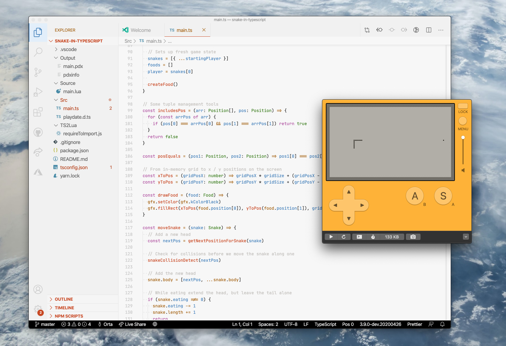

### Snake in TypeScript



An example of using the Playdate API with TypeScript to build a Snake game

### Getting set up

```sh
git clone ...
cd ...
yarn install
```

Then open the editor:

```sh
code .
```

You realistically need copy of [vscode-playdate](https://devforum.play.date/t/vs-code-extension/356/4) set up in your editor to get working efficiently. From there, you can hit the run button in the debugging panel to start everything up.

### How it works

Pressing start will:

 - Run the Playdate compiler over `Source`
 - Start the TypeScript to Lua watcher

This repo uses [`TypeScriptToLua`](https://typescripttolua.github.io) to convert `*.ts` files in `Src` to `Source`.

### Files of interest

- `TS2Lua/requireToImport.js` - a plugin for TypeScriptToLua which makes the emitted Lua files use `import` and not `require`
- `playdate.d.ts` - an ambient declaration file (e.g. one that affects global scope) which adds the playdate SDK globals

### Keybindings

If you come from a Mac background, these are keybindings which I think makes your life easier for Xcode-like running of your app.

```json
[
      {
        "key": "cmd+r",
        "command": "workbench.action.debug.start",
        "when": "!inDebugMode"
    },
    {
        "key": "cmd+r",
        "command": "workbench.action.debug.restart",
        "when": "inDebugMode"
    },
    {
        "key": "cmd+shift+r",
        "command": "workbench.action.debug.restart"
    },
    {
        "key": "cmd+shift+.",
        "command": "workbench.action.debug.stop"
    }
]
```

Here's my full keybindings for reference also

```json
[
    {
        "key": "ctrl+cmd+left",
        "command": "workbench.action.navigateBack"
    },
    {
        "key": "ctrl+cmd+right",
        "command": "workbench.action.navigateForward"
    },
    {
        "key": "cmd+e",
        "command": "editor.action.addSelectionToNextFindMatch"
    },
    {
        "key": "cmd+t",
        "command": "workbench.action.quickOpen"
    },
    {
        "key": "cmd+r",
        "command": "workbench.action.debug.start",
        "when": "!inDebugMode"
    },
    {
        "key": "cmd+r",
        "command": "workbench.action.debug.restart",
        "when": "inDebugMode"
    },
    {
        "key": "cmd+shift+r",
        "command": "workbench.action.debug.restart"
    },
    {
        "key": "cmd+shift+.",
        "command": "workbench.action.debug.stop"
    },
    {
        "key": "cmd+shift+[",
        "command": "workbench.action.previousEditor"
    },
    {
        "key": "cmd+shift+]",
        "command": "workbench.action.nextEditor"
    },
    {
        "key": "ctrl+cmd+e",
        "command": "editor.action.changeAll"
    },
    {
        "key": "cmd+1",
        "command": "workbench.view.explorer"
    },
    {
        "key": "cmd+2",
        "command": "workbench.view.search"
    },
    {
        "key": "cmd+3",
        "command": "workbench.view.git"
    },
    {
        "key": "cmd+4",
        "command": "workbench.view.debug"
    },
    {
        "key": "cmd+5",
        "command": "workbench.view.extensions"
    },
    {
        "key": "cmd+enter",
        "command": "editor.action.goToDeclaration",
        "when": "editorTextFocus"
    },
    {
        "key": "cmd+.",
        "command": "editor.action.triggerSuggest",
        "when": "editorHasCompletionItemProvider && editorTextFocus && !editorReadonly"
    },
    {
        "key": "cmd+k p",
        "command": "editor.action.previewDeclaration",
        "when": "editorHasDefinitionProvider && editorTextFocus && !inReferenceSearchEditor && !isInEmbeddedEditor"
    },
    {
        "key": "cmd+k f",
        "command": "editor.action.referenceSearch.trigger",
        "when": "editorHasReferenceProvider && editorTextFocus && !inReferenceSearchEditor && !isInEmbeddedEditor"
    },
    {
        "key": "cmd+k e",
        "command": "editor.action.rename",
        "when": "editorHasRenameProvider && editorTextFocus && !editorReadonly"
    },
    {
        "key": "cmd+shift n",
        "command": "workbench.action.files.newUntitledFile",
        "when": "editorTextFocus"
    },
    {
        "key": "shift+cmd+t",
        "command": "workbench.action.terminal.toggleTerminal"
    },
    {
        "key": "ctrl+`",
        "command": "-workbench.action.terminal.toggleTerminal"
    },
    {
        "key": "ctrl+.",
        "command": "toggleSuggestionDetails",
        "when": "editorTextFocus && suggestWidgetVisible"
    },
    {
        "key": "ctrl+space",
        "command": "-toggleSuggestionDetails",
        "when": "editorTextFocus && suggestWidgetVisible"
    },
    {
        "key": "shift+cmd+.",
        "command": "editor.action.quickFix",
        "when": "editorHasCodeActionsProvider && editorTextFocus && !editorReadonly"
    },
    {
        "key": "cmd+.",
        "command": "-editor.action.quickFix",
        "when": "editorHasCodeActionsProvider && editorTextFocus && !editorReadonly"
    },
    {
        "key": "ctrl+1",
        "command": "workbench.action.focusFirstEditorGroup"
    },
    {
        "key": "cmd+1",
        "command": "-workbench.action.focusFirstEditorGroup"
    },
    {
        "key": "ctrl+2",
        "command": "workbench.action.focusSecondEditorGroup"
    },
    {
        "key": "cmd+2",
        "command": "-workbench.action.focusSecondEditorGroup"
    },
    {
        "key": "ctrl+3",
        "command": "workbench.action.focusThirdEditorGroup"
    },
    {
        "key": "cmd+3",
        "command": "-workbench.action.focusThirdEditorGroup"
    },
    {
        "key": "ctrl+alt+left",
        "command": "workbench.action.navigateEditorGroups"
    },
    {
        "key": "ctrl+alt+right",
        "command": "workbench.action.navigateEditorGroups"
    },
    {
        "key": "cmd+l",
        "command": "workbench.action.gotoLine"
    },
    {
        "key": "ctrl+g",
        "command": "-workbench.action.gotoLine"
    }
]
```

